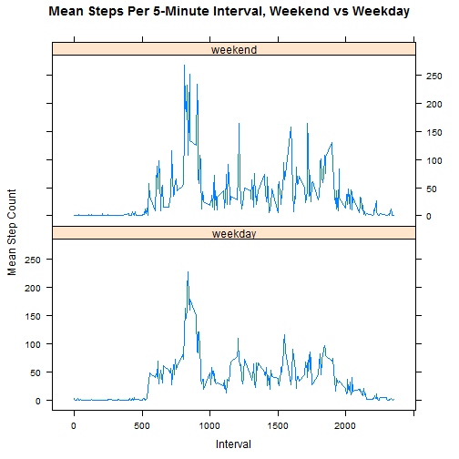

---
---

>The following will read the data in.


```r
data <- read.csv("C:/Users/Mitch/Documents/DataScience/repdata-data-activity/activity.csv")
```


>This section will take all the missing values out of the data and calculate the daily step totals.


```r
newdata <- data[!is.na(data$steps),]
dailyagg <- setNames(aggregate(newdata$steps,by=list(newdata$date),FUN=sum),c("date","steps"))
dailyagg
```

```
##          date steps
## 1  2012-10-02   126
## 2  2012-10-03 11352
## 3  2012-10-04 12116
## 4  2012-10-05 13294
## 5  2012-10-06 15420
## 6  2012-10-07 11015
## 7  2012-10-09 12811
## 8  2012-10-10  9900
## 9  2012-10-11 10304
## 10 2012-10-12 17382
## 11 2012-10-13 12426
## 12 2012-10-14 15098
## 13 2012-10-15 10139
## 14 2012-10-16 15084
## 15 2012-10-17 13452
## 16 2012-10-18 10056
## 17 2012-10-19 11829
## 18 2012-10-20 10395
## 19 2012-10-21  8821
## 20 2012-10-22 13460
## 21 2012-10-23  8918
## 22 2012-10-24  8355
## 23 2012-10-25  2492
## 24 2012-10-26  6778
## 25 2012-10-27 10119
## 26 2012-10-28 11458
## 27 2012-10-29  5018
## 28 2012-10-30  9819
## 29 2012-10-31 15414
## 30 2012-11-02 10600
## 31 2012-11-03 10571
## 32 2012-11-05 10439
## 33 2012-11-06  8334
## 34 2012-11-07 12883
## 35 2012-11-08  3219
## 36 2012-11-11 12608
## 37 2012-11-12 10765
## 38 2012-11-13  7336
## 39 2012-11-15    41
## 40 2012-11-16  5441
## 41 2012-11-17 14339
## 42 2012-11-18 15110
## 43 2012-11-19  8841
## 44 2012-11-20  4472
## 45 2012-11-21 12787
## 46 2012-11-22 20427
## 47 2012-11-23 21194
## 48 2012-11-24 14478
## 49 2012-11-25 11834
## 50 2012-11-26 11162
## 51 2012-11-27 13646
## 52 2012-11-28 10183
## 53 2012-11-29  7047
```


>This section produces a histogram of the total steps per day.        


```r
hist(dailyagg$steps, main = "Histogram of Total Steps", xlab = "Steps", col = "red")
```

 


>This section will calculate the mean and median of the steps per day.


```r
meanDailySteps <- mean(dailyagg$steps)
medianDailySteps <- median(dailyagg$steps)
sprintf("Mean daily steps: %g", meanDailySteps)
```

```
## [1] "Mean daily steps: 10766.2"
```

```r
sprintf("Median daily steps: %i", medianDailySteps)
```

```
## [1] "Median daily steps: 10765"
```


>The following will create a plot showing the average daily activity pattern.


```r
dailyMean <- setNames(aggregate(newdata$steps,by=list(newdata$interval),FUN=mean),c("interval","steps"))
plot(dailyMean$interval, dailyMean$steps, type = "l", xlab = "5-minute Interval", ylab = "Average Step Count")
```

 


>This section will find which interval has the max number of steps in it.


```r
maxinterval <- as.character(dailyMean$interval[which.max(dailyMean$steps)])
sprintf("Time interval with maximum steps: %s",maxinterval)
```

```
## [1] "Time interval with maximum steps: 835"
```


>This section will calculate the amount of missing values in the dataset.


```r
sprintf("Total number of missing values: %i", sum(is.na(data$steps)))
```

```
## [1] "Total number of missing values: 2304"
```


>Devise a strategy for filling in all of the missing values in the dataset. Create a new dataset that is equal to the original dataset but with the missing data filled in. 
>I am going to solve this problem by replacing the missing values with the rounded value of the mean from the same time interval in which the missing value is located.


```r
missing <- which(is.na(data$steps))
inputedsteps <- data
intervalagg <- setNames(aggregate(newdata$steps,by=list(newdata$interval),FUN=sum, na.rm=TRUE),c("interval","steps"))
intervalagg <- aggregate(steps ~ interval, newdata, mean)
for (i in missing) {
    inputedsteps$steps[i] <- 
      with(intervalagg, round(steps[interval == inputedsteps$interval[i]]),0)
}
```


>Now I will create a histogram of the new results.


```r
inputeddailyagg <- setNames(aggregate(inputedsteps$steps,by=list(inputedsteps$date),FUN=sum),c("date","steps"))
hist(inputeddailyagg$steps,main="Histogram of Total Steps Per Day",xlab="Steps",col="red")
```

 


>This part will get the mean and median of the total steps taken per day.


```r
inputdailystepsmean <- mean(inputeddailyagg$steps,na.rm=TRUE)
inputdailystepsmedian <- median(inputeddailyagg$steps,na.rm=TRUE)
sprintf("Mean daily imputed steps: %g", inputdailystepsmean)
```

```
## [1] "Mean daily imputed steps: 10765.6"
```

```r
sprintf("Median daily imputed steps: %i", inputdailystepsmedian)
```

```
## [1] "Median daily imputed steps: 10762"
```


>In this section we are going to create a new column with days that are the weekend.


```r
inputedsteps$dayclass<-ifelse(weekdays(strptime(levels(inputedsteps$date), format="%Y-%m-%d")) %in% c("Saturday","Sunday"), "weekend", "weekday")
inputedsteps$dayclass <- as.factor(inputedsteps$dayclass)
inputedweekend <- setNames(aggregate(inputedsteps$steps, by=list(inputedsteps$dayclass,inputedsteps$interval), FUN=mean),c("dayclass","Interval","Steps"))
```


>This final section will show a graph of the difference in step count between weekends and weekdays.


```r
library(lattice)
xyplot(Steps ~ Interval | dayclass, data=inputedweekend, type="l", layout=c(1,2), ylab = "Mean Step Count", main="Mean Steps Per 5-Minute Interval, Weekend vs Weekday")
```

 
